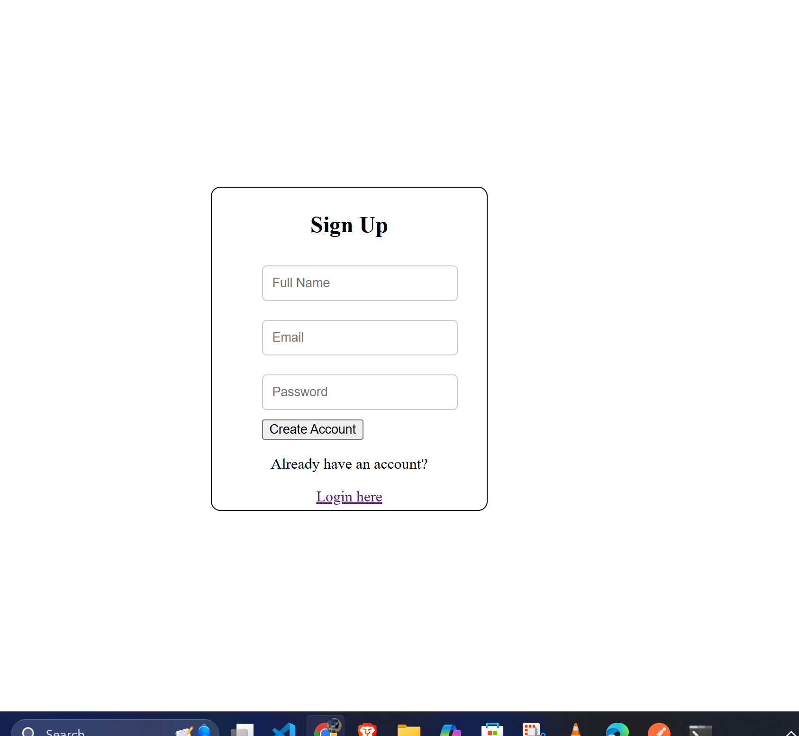
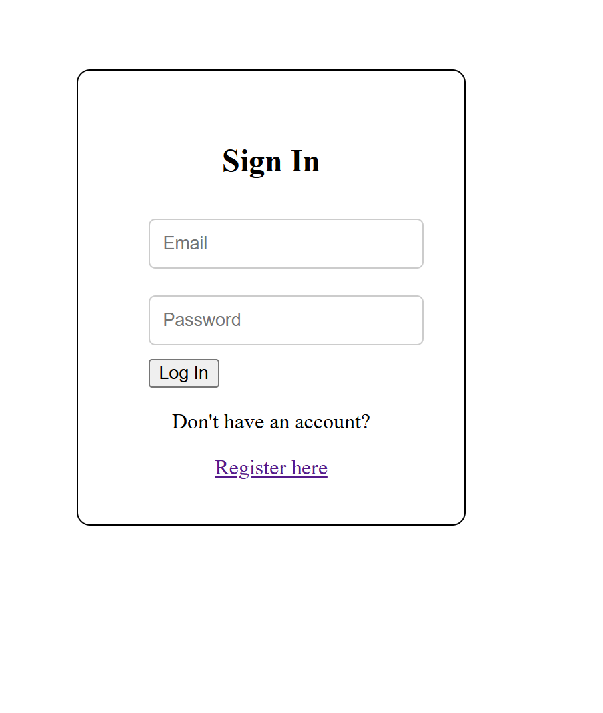

# React + Vite

This project is a React application set up with Vite, utilizing React Router for navigation.

## Project Overview
The application features the following main routes:
- `/`: Renders the Homepage component.
- `/signin`: Renders the Login page component.
- `/register`: Renders the Registration page component.
- `/dashbord`: Renders the Energy Dashboard component.

The application is rendered in `StrictMode` for better development practices.

## Project Structure
```
.
├── public/                  # Static assets
├── src/                     # Source code
│   ├── components/          # React components
│   │   ├── dashbord/       # Dashboard components
│   │   ├── home/           # Home components
│   │   ├── login/          # Login components
│   │   └── register/       # Registration components
│   ├── routes/             # Application routes
│   ├── App.jsx             # Main application component
│   └── main.jsx            # Entry point
├── .gitignore               # Git ignore file
├── package.json             # Project dependencies and scripts
└── README.md                # Project documentation
```

## the interfaces are
 



## Technologies and Packages
- **React**: A JavaScript library for building user interfaces.
- **Vite**: A build tool that provides a fast development environment.
- **React Router**: A library for routing in React applications.
- **Material-UI**: A popular React UI framework that provides pre-built components.
- **Chart.js**: A library for creating charts and graphs.
- **Socket.IO**: A library for real-time web applications.
- **ESLint**: A tool for identifying and fixing problems in JavaScript code.

## Responsive Design
The application is designed to be responsive, utilizing CSS modules and Material-UI components to ensure a consistent user experience across different screen sizes.
